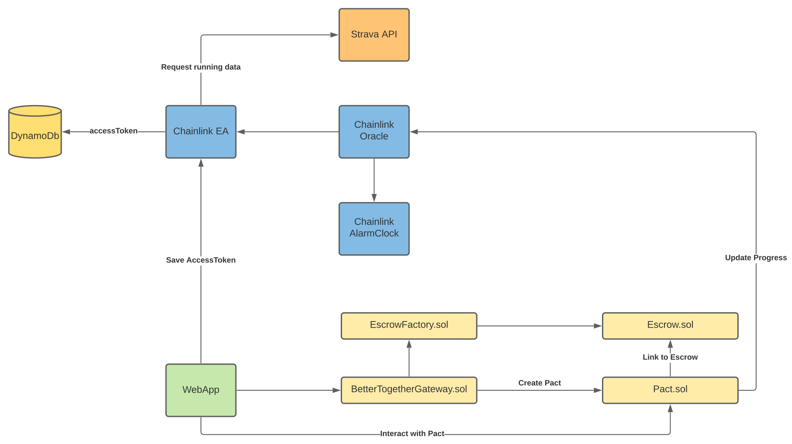

## Together We Run: A decentralized fitness goal platform powered by Chainlink and Ethereum

## Description
### Summary
The importance of health and fitness has garnered increasing awareness over the past decades and is a major striving point in society. One of the most predominant issues with building good habits with fitness is primarily due to the aspect of motivation. In a world where a vast amount of finances are spent on memberships, coaches, and other external motivational aspects, we would like to offer a different approach. Studies have shown that peer motivation and positive reinforcement builds some of the best habits and we have attempted to pull together that foundation with the help of smart contracts.

Our smart contract allows an individual to construct a fitness goal with friends, all make pledge amounts towards it, and have it automatically return their pledge based on smart contracts. In our demo, we leverage the Ethereum blockchain to lock in a set goal of running with pledged funds, and Chainlink to interface with an external fitness tracker (Strava) to automatically detect completion. If all friends are able to meet the goal within the set timeframe, they will receive their pledged amounts back to their wallets, otherwise it will be donated to a pre-selected charity wallet address.

### Demo Video
[Insert Video]

### Live Demo
[Insert Live Demo Link]

### Architecture Diagram


## Build and Deployment

There are several building block as part of this application included in this repository:

### Contracts
The main contracts have two parts, the *BetterTogetherGateway* and *Pact* which are configured to deploy via the hardhat development environment.

The *BetterTogetherGateway* is the front facing contract which interacts with various users to create or join existing *Pacts*. It also contains the lists of *Pacts* that are created to keep track of what has been created.

The *Pact* allows a "Host" user to configure the contract with settings such as the miles to run, the pledge amount required, and the goal deadline timeframe. "Friends" can join this *Pact* via an invite code upon which the "Host" can then start the pact.

To deploy the smart contracts, generate an `.env` file with the following in the root folder:
```
PRIVATE_KEY='WALLET_PRIVATE_KEY"
KOVAN_RPC_URL='https://kovan.infura.io/v3/[INSERT_INFURA_URL]
```
Assuming hardhat is installed, the contracts can be deployed via:
```
> npx hardhat run --network kovan scripts/deploy.js
```
### Strava External Adapter
This is a custom external adapter that will hit the Strava endpoint and retrieve tracked fitness data for a user (i.e. miles run). The response is passed to a configured chainlink node which will update the contracts with the retrieved values.

Currently the customer external adapter also incorporates a separate server that stores user's Strava API keys into a dynamo database upon initial oauth on the front end web application. This allows API keys to be kept private from being exposed on the public facing blockchain.

The Strava external adapter can be executed via the following, and will be listening on *http://localhost:8080*
```
> cd StravaExternalAdapter
> yarn install
> yarn start
```
### Web App
The webapp can be deployed with the following, first making sure that the contract addresses are properly loaded with the front end in `webapp/packages/contracts/src/address.js`. 

Modify the *BetterTogetherGateway* and *EscrowFactory* contract addresses to be the deployed contract files.

Then install dependencies and run the web application
```
> cd webapp/packages/react-app
> yarn install
> yarn start
```
The webapp can be viewed on *http://localhost:3000*
